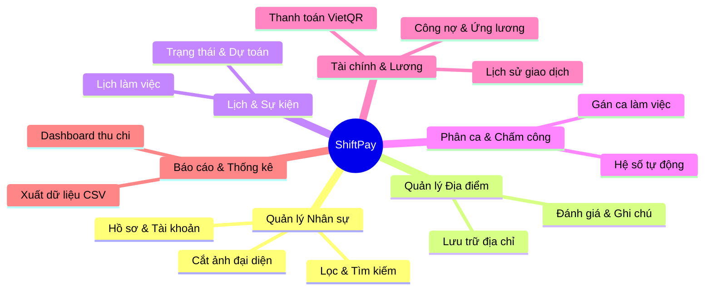
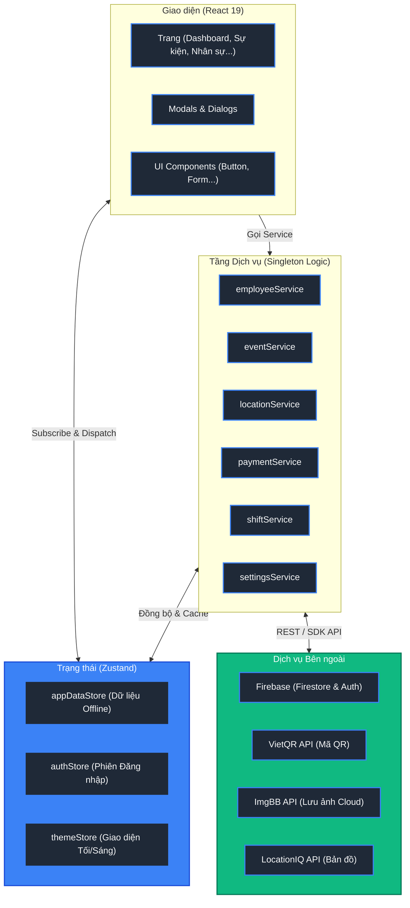
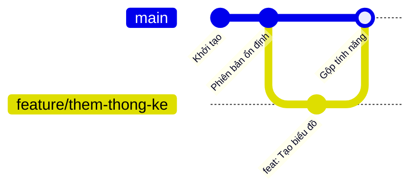

<div align="center">
  
  <h3>Hệ thống Quản lý Nhân sự, Phân ca & Tính lương Tự động</h3>
  
  <p align="center">
    
    
    
    
    
    
    
  </p>
</div>

---

## 📖 Mục lục

1. [Giới thiệu](#-giới-thiệu)
2. [Tính năng chính](#-tính-năng-chính)
3. [Kiến trúc tổng quan](#-kiến-trúc-tổng-quan)
4. [Cài đặt](#-cài-đặt)
5. [Chạy project](#-chạy-project)
6. [Env configuration](#-env-configuration)
7. [Cấu trúc thư mục](#-cấu-trúc-thư-mục)
8. [Hướng dẫn đóng góp](#-hướng-dẫn-đóng-góp)
9. [Giấy phép](#-giấy-phép)

---

## 1. 🌟 Giới thiệu

**ShiftPay** là giải pháp phần mềm tự động hóa quản lý nhân sự, phân ca làm việc, chấm công và tính lương. Ứng dụng chuyên phục vụ các mô hình kinh doanh F&B, nhà hàng, sự kiện và tiệc lưu động.

> [!IMPORTANT]
> **Sứ mệnh:** Số hóa quy trình chấm công, tự động hóa bảng lương và tích hợp thanh toán nhanh qua VietQR, giúp giảm 80% thời gian vận hành và loại bỏ sai sót tài chính.

### Điểm nổi bật

- **⚡ Hiệu suất cao:** Xây dựng trên nền tảng React 19 và Vite mới nhất.
- **🌐 Offline-first:** Bộ nhớ đệm cục bộ thông minh, thao tác mượt mà khi mất kết nối mạng và đồng bộ ngầm khi có Internet.
- **💳 Chạm thanh toán:** Tự động tạo mã QR chuyển khoản chính xác đến từng đồng qua hệ thống VietQR.

---

## 2. 🚀 Tính năng chính



- **👥 Nhân sự & Hồ sơ:** Quản lý thông tin cá nhân, tài khoản ngân hàng, tích hợp công cụ cắt ảnh và tìm kiếm thông minh.
- **📍 Địa điểm làm việc:** Quản lý danh sách điểm tổ chức, đánh giá chất lượng và ghi chú đặc thù.
- **📅 Lịch & Sự kiện:** Giao diện trực quan theo dõi tiến độ sự kiện, liên kết địa điểm và dự toán chi phí.
- **⏰ Phân ca & Chấm công:** Gán ca làm linh hoạt (Sáng/Chiều/Tối), tự động áp dụng hệ số giờ làm để tính thu nhập.
- **💳 Tài chính & Quyết toán:** Tổng hợp công nợ, quản lý tạm ứng, tạo mã QR thanh toán nhanh qua VietQR và lưu trữ lịch sử minh bạch.
- **📊 Báo cáo & Thống kê:** Biểu đồ trực quan theo dõi dòng tiền (`recharts`) và hỗ trợ trích xuất dữ liệu công lương ra tệp CSV.
- **🎨 Trải nghiệm UI/UX:** Giao diện tương thích đa thiết bị, hỗ trợ chế độ Tối/Sáng và thao tác Pull-to-refresh trên thiết bị di động.

<br>


---

## 3. 🏗️ Kiến trúc tổng quan

ShiftPay ứng dụng kiến trúc **Modular Frontend** kết hợp **Service-based Repository**, tách biệt hoàn toàn logic tương tác dữ liệu khỏi giao diện hiển thị.



1. **Presentation Layer:** Kết xuất giao diện (React 19, Tailwind CSS, Framer Motion) và kiểm tra dữ liệu đầu vào (`Zod`).
2. **State Management:** Lưu trữ trạng thái toàn cục với Zustand, phân tách rõ ràng giúp tối ưu hóa hiệu suất.
3. **Service Layer:** Cầu nối xử lý nghiệp vụ, giao tiếp với cơ sở dữ liệu và tự động thử lại (retry logic) khi mạng chập chờn.
4. **Backend & Cloud:** Cơ sở dữ liệu thời gian thực và quản lý định danh qua Firebase, tích hợp các API hình ảnh và cổng thanh toán.

---

## 4. ⚙️ Cài đặt

- **Node.js:** `>= 20.0.0`
- **npm:** `>= 10.0.0`
- **Git:** Đã cài đặt trên hệ thống.

```bash
# 1. Clone repository
git clone https://github.com/dexter826/at_shiftpay.git
cd at_shiftpay

# 2. Cài đặt thư viện phụ thuộc
npm install
```

---

## 5. 🏃 Chạy project

```bash
# Khởi động máy chủ phát triển (http://localhost:5173)
npm run dev

# Kiểm tra lỗi kiểu TypeScript và đóng gói Production
npm run build

# Xem trước phiên bản Production cục bộ
npm run preview
```

> [!NOTE]
> Môi trường phát triển hỗ trợ tính năng HMR (Hot Module Replacement) giúp cập nhật giao diện ngay lập tức khi chỉnh sửa mã nguồn.

---

## 6. 🔐 Env configuration

Tạo tệp `.env` tại thư mục gốc của dự án (ngang hàng `package.json`) với cấu trúc mẫu sau:

```env
# 1. CẤU HÌNH HỆ THỐNG FIREBASE (BẮT BUỘC)
VITE_FIREBASE_API_KEY=your_firebase_api_key_here
VITE_FIREBASE_AUTH_DOMAIN=your_project_id.firebaseapp.com
VITE_FIREBASE_PROJECT_ID=your_project_id
VITE_FIREBASE_STORAGE_BUCKET=your_project_id.firebasestorage.app
VITE_FIREBASE_MESSAGING_SENDER_ID=your_sender_id_here
VITE_FIREBASE_APP_ID=your_app_id_here

# 2. CẤU HÌNH LƯU TRỮ HÌNH ẢNH (https://api.imgbb.com/)
VITE_IMGBB_API_KEY=your_imgbb_api_key_here

# 3. CẤU HÌNH BẢN ĐỒ (https://locationiq.com/)
VITE_LOCATIONIQ_API_KEY=your_locationiq_api_key_here
```

### Bảng Mô tả Biến Môi trường

| Biến môi trường              | Trạng thái | Mô tả chi tiết                                               |
| :--------------------------- | :--------: | :----------------------------------------------------------- |
| `VITE_FIREBASE_API_KEY`      |  Bắt buộc  | Mã khóa API giao tiếp với các dịch vụ Firebase.              |
| `VITE_FIREBASE_AUTH_DOMAIN`  |  Bắt buộc  | Tên miền xác thực (Authentication Domain) của Firebase.      |
| `VITE_FIREBASE_PROJECT_ID`   |  Bắt buộc  | Định danh duy nhất của dự án Firebase.                       |
| `VITE_FIREBASE_STORAGE_...`  |  Bắt buộc  | Địa chỉ đám mây (Storage Bucket) lưu trữ tệp tin.            |
| `VITE_FIREBASE_MESSAGING...` |  Bắt buộc  | Mã định danh người gửi tin nhắn hệ thống.                    |
| `VITE_FIREBASE_APP_ID`       |  Bắt buộc  | Mã định danh ứng dụng web tạo trong Firebase Console.        |
| `VITE_IMGBB_API_KEY`         |  Tùy chọn  | Khóa truy cập API lưu trữ ảnh đại diện trực tiếp lên ImgBB.  |
| `VITE_LOCATIONIQ_API_KEY`    |  Tùy chọn  | Khóa truy cập API hỗ trợ tính năng định vị tọa độ và bản đồ. |

---

## 7. 📁 Cấu trúc thư mục

```text
at_shiftpay/
├── dist/                # Mã nguồn Production đã được tối ưu hóa
├── docs/                # Tài liệu thiết kế và hình ảnh minh họa
├── public/              # Tài nguyên tĩnh công khai (Logo, favicon...)
├── src/                 # KHO MÃ NGUỒN CHÍNH
│   ├── animations/      # Cấu hình hoạt ảnh Framer Motion
│   ├── assets/          # Dữ liệu tĩnh, hoạt ảnh Lottie
│   ├── components/      # KHO COMPONENT REACT (auth, common, layout, modals, pages, ui)
│   ├── constants/       # Hằng số toàn cục, mã màu sắc
│   ├── hooks/           # Custom React Hooks
│   ├── lib/             # Các thư viện bổ trợ
│   ├── services/        # TẦNG DỊCH VỤ (employee, event, location, shift, payment, export...)
│   ├── stores/          # TẦNG TRẠNG THÁI ZUSTAND (appData, auth, theme)
│   ├── utils/           # Các hàm tiện ích format, tính toán
│   ├── App.tsx          # Điểm neo chính kết nối Router và Providers
│   ├── index.css        # Khai báo CSS và Tailwind
│   └── types.ts         # Khai báo toàn bộ Interface & Type TypeScript
├── .env                 # Khai báo biến môi trường cục bộ
├── firebase.json        # Cấu hình quy tắc Firebase Hosting
├── firestore.rules      # Quy tắc phân quyền bảo mật Firestore
└── vite.config.ts       # Cấu hình đóng gói Vite
```

---

## 8. 🤝 Hướng dẫn đóng góp

### Quy trình Đóng góp (Git Workflow)



1. **Fork** kho lưu trữ về tài khoản GitHub cá nhân.
2. **Tạo nhánh mới:** `git checkout -b feature/ten-tinh-nang`
3. **Thực thi thay đổi:** Đảm bảo mã nguồn sạch, không lỗi kiểm tra cú pháp (lint).
4. **Commit:** `git commit -m "feat: Bổ sung tính năng mới"`
5. **Push:** `git push origin feature/ten-tinh-nang`
6. **Tạo Pull Request (PR):** Hướng đến nhánh `main` của kho lưu trữ gốc.

---

## 9. 📄 Giấy phép

<div align="center">
  <i>Ứng dụng được làm ra với mục đích phục vụ nội bộ và không nhằm mục đích thương mại.</i>
</div>

<br>

<div align="center">Made with ❤️ by <a href="https://github.com/dexter826">MOB</a></div>
